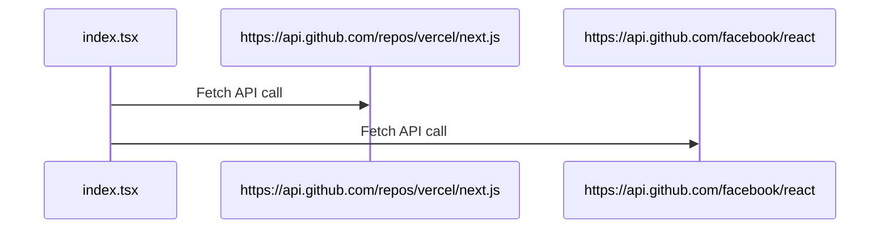
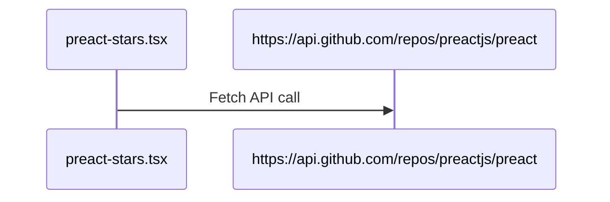

# Code Structure Visualizer

This project serves as a proof of concept demonstrating the use of static code analysis to identify API calls within web application pages and generate an architecture diagram based on those calls.

In modern web applications, understanding the flow of API calls and their interactions with different parts of the application is crucial for efficient development and optimization. This project aims to leverage static code analysis to automatically detect and visualize API calls within different pages of a modern web application.

## Features

- Static code analysis to identify API calls within pages.
- Generation of an architecture diagram ([using mermaid.js](https://mermaid.js.org/)) showcasing API call interactions.
- Extensible for supporting different frameworks and libraries.

## Architecture Diagram Result

> Note: we make two API calls in [index.tsx](./example-projects/next-data-fetch-app/pages/index.tsx) and one API call in [preact-stars.tsx](./example-projects/next-data-fetch-app/pages/preact-stars.tsx)

# Page: ./example-projects/next-data-fetch-app/pages/index.tsx



# Page: ./example-projects/next-data-fetch-app/pages/preact-stars.tsx



## Installation

> Note: This project uses a Next.js application in the `/example-projects` folder, but you do not need to install it's dependencies to analyze it

1. Clone this repository to your local machine:

   ```sh
   git clone https://github.com/Gonzalo8642/code-structure-visualizer.git
   cd
   ```

2. Install Dependencies at the root directory

   ```sh
   npm install
   ```

3. Run the project
   ```sh
   npm start # Will create code_structure.mermaid.md file after analyzing the example project
   ```
   ```sh
   npm run outputJson # Will output in json format
   ```
   ```sh
   npm run outputPretty # Will output in an organized text format
   ```
