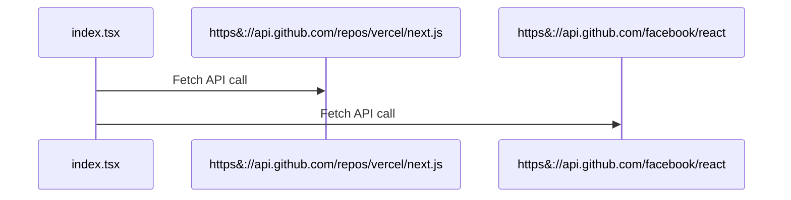
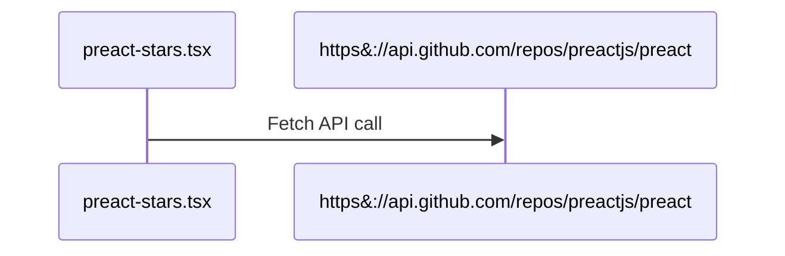

# Page: ./example-projects/next-data-fetch-app/pages/index.tsx

```mermaid
sequenceDiagram
  /index.tsx->>"https_//api.github.com/repos/vercel/next.js": Fetch API call
  participant "https_//api.github.com/repos/vercel/next.js" as https&#58;//api.github.com/repos/vercel/next.js
  /index.tsx->>"https_//api.github.com/facebook/react": Fetch API call
  participant "https_//api.github.com/facebook/react" as https&#58;//api.github.com/facebook/react
```
# Page: ./example-projects/next-data-fetch-app/pages/preact-stars.tsx

```mermaid
sequenceDiagram
  /preact-stars.tsx->>"https_//api.github.com/repos/preactjs/preact": Fetch API call
  participant "https_//api.github.com/repos/preactjs/preact" as https&#58;//api.github.com/repos/preactjs/preact
```
